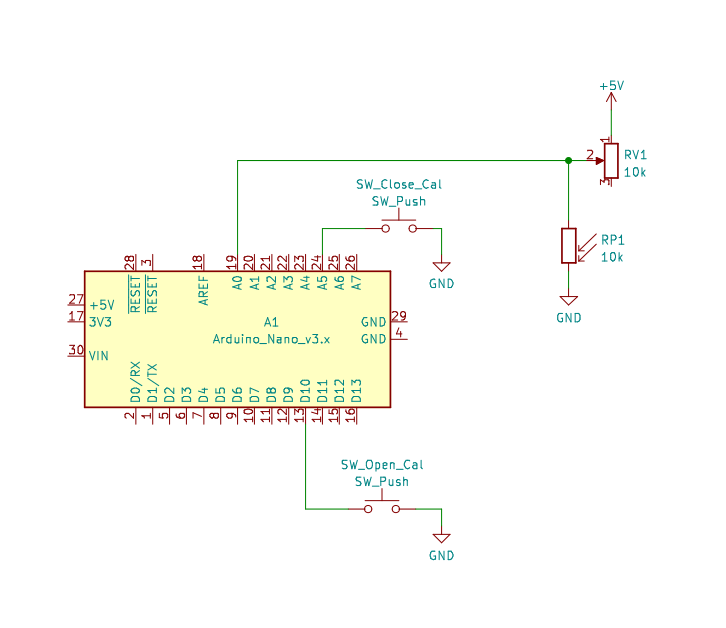

# arduino_shutterspeed
Test the shutterspeed of your camera using an Arduino and a photocell

## How to use
1. Open the Serial Monitor
2. Position the lens between a light source and the photoresistor such that when the lens is open, light falls on the sensor.
3. With the lens open, press the "Open Shutter Calibration Button", this saves the current sensor reading as the aamount of light indicating an open shutter
4. Close the shutter and press the "Closed Shutter Calibration Button"
5. From now on, each time the shutter opens then closes, a number will be printed on a new line. This is the number of microseconds that the shutter was open, divide by 1,000,000 to get the time in seconds

## Wiring
Adjust wiring and code according to pin availability

